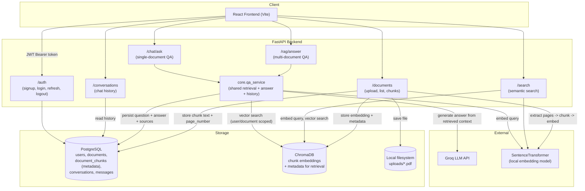
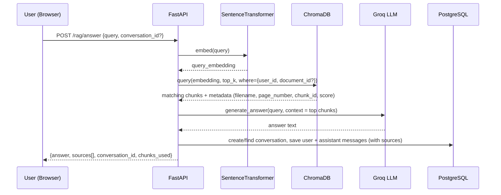

# Architecture

## Overview

The system lets an authenticated user upload PDF documents, which are text-extracted,
chunked (with page numbers preserved), embedded, and indexed in ChromaDB. Users can then
ask natural-language questions and receive answers grounded in the uploaded documents,
along with source references (filename, page number, chunk id). All Q&A turns are
persisted as chat history.

- **Backend**: FastAPI (Python)
- **Frontend**: React (Vite)
- **Relational store**: PostgreSQL — users, documents, chunk metadata, conversations, messages
- **Vector store**: ChromaDB (persistent, local) — chunk embeddings + retrieval
- **Embeddings**: SentenceTransformer (`all-MiniLM-L6-v2`), local/offline
- **LLM**: Groq (`llama-3.1-8b-instant`) for answer generation
- **Auth**: JWT access tokens + refresh tokens (existing, unchanged)

## Component diagram

## Request flow: asking a question

## Data model

- **users** — auth accounts
- **documents** — `id, user_id, filename, file_path, uploaded_at`
- **document_chunks** — `id, document_id, chunk_index, page_number, text` (relational
  metadata; the `embedding` column is legacy/unused post-migration — vectors now live in
  ChromaDB)
- **conversations** — `id, user_id, title, created_at`
- **messages** — `id, conversation_id, sender, content, sources (JSON), created_at`
- **ChromaDB collection `document_chunks`** — one vector per chunk, id `"{document_id}_{chunk_index}"`,
  metadata `{user_id, document_id, filename, page_number, chunk_index}`

## Why ChromaDB replaced the Postgres vector column

The original implementation stored embeddings in a Postgres `ARRAY(Float)` column and
did brute-force cosine similarity in Python for every query. This was replaced with a
ChromaDB persistent collection (`backend/chroma_db/`), which handles vector indexing and
similarity search natively. Postgres keeps owning relational metadata (chunk text, page
numbers, user/document ownership, chat history) since ChromaDB is not meant to replace a
relational store for that data.

Existing embeddings already stored in Postgres (from before this change) were backfilled
into ChromaDB by `backend/app/backfill_chroma.py` — see README for how to run it.
